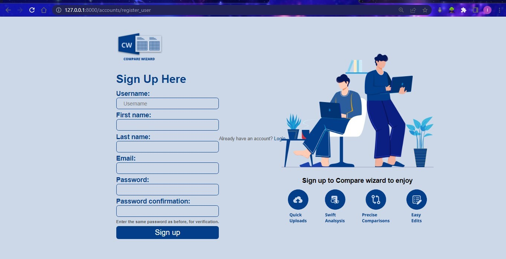
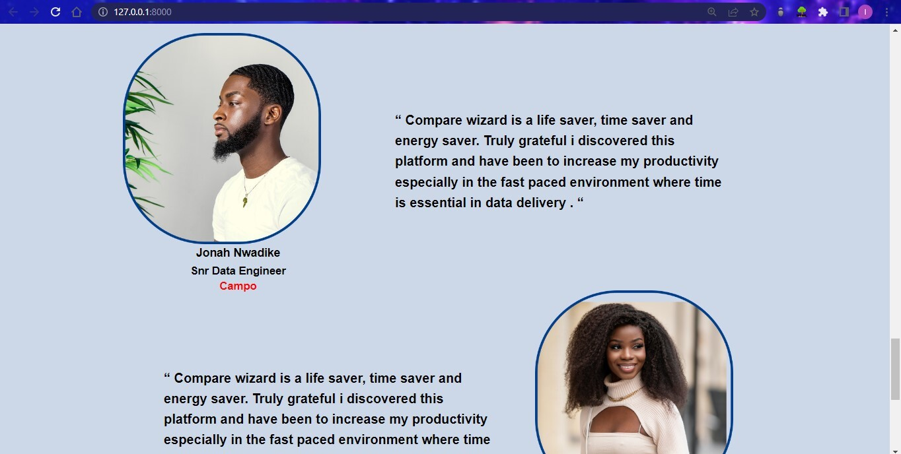

# Compare Wizard - Excel comp Project

  

A platform that helps users compare the content of excel files <https://docs.google.com/document/d/1VhBXWWhO64190HyiqDvl8ANx8rS-RiDRvHcwEz6hJvM/edit>

## Deployed at http://oreoa.pythonanywhere.com

## Introduction
An I4G x Zuri Project- This platform reads an excel file and search for duplicates, then ask User to pick one of the options to remove duplicate and print a separate file or in the same file, highlight duplicate and print in a seperate file or the same file 
### Application Schema
This project is built with the Django framework and four(4) main development languages; HTML, CSS, JS & Python.

## Features
* Highlight duplicates in a single file
* Remove duplicates and return a single file
* Remove duplicates and return 2 files
* Highlight duplicates and return 2 files
* Show usage example to users
* Allow user save data and download later
* Find and replace data in files
* Delete files
* Download result in different format {PDF, XLS, XLSX, CSV} 
* Toggle Light and dark mode

  

  

### Links			
* [RESEARCH PLAN](https://docs.google.com/document/d/1Mv-0xBJvX8l-tcY9u_iq2AERaXqGLLfakH7fyUtju88/edit?usp=sharing)	
* [FIGMA](https://www.figma.com/file/yzxxleZQG9HEVYpC3A1TSr/TEAM-110?node-id=0%3A1)	
* [FIGJAM LINK](https://www.figma.com/file/gU9iDjNYoZtHOvB8eOO5Gd/Compare-Wizard-User-Research?node-id=0%3A1)			
* [DOCUMENTATION (Dev)](https://docs.google.com/document/d/1rf4vAwM_4ctHkh_6PJbRFSj-YQt7Q_2ialSy57bzXYI/edit)		
* [PRESENTATION SLIDES](https://www.figma.com/file/yzxxleZQG9HEVYpC3A1TSr/TEAM-110?node-id=503%3A12026) 			
* [DATABASE SCHEMA](https://docs.google.com/document/d/1J5EpO_79fhwUvqlS58ODnmF5nX8Porzsa-cKodv7PqI/edit)			
* [GITHUB REPO](https://github.com/zuri-training/Excel_comp_team_110)		

### Contributors
* Iruoma Valerie - Iruoma Valerie
* Akinbinu Tolulope kresha - Tolulope Kresha 
* Isaiah Kayode Ajayi - Isaiah 
* Hauwa Yusuf - Hauwa 
* Omoigberale Onyebuchi - Onyebuchi Omoigberale 
* Medina Folashade Sheriff - Emdee 
* Dimaroh Kelvin Ogheneobruche - Kelvindim 
* Okereke Praise Chinemeremun - Prai5e
* Oreoluwa Akanni - OreoA09 
* Uduije Calista - Caly 
* Confidence Ekine - Confidence Ekine 
* Jesse philip zubairu - jessezee 
* Temi Apantaku - Qkhlys 
* Ephraim Omenai - e_omenai 
* Abdulsalam Baruwa - dmysticalCoder 
* Popoola victoria adeola - Victoria Popoola 
* Solagbade Omolola O. - lollybeez 
* Ekpubeni Avwerosuoghene Nature - Nature Reuben 
* Adesiyan Adepeju Ifetunbi - AdepejuIfe 
* Hope Akpabio - Future_stacks

## Deploying Project Locally
Compare Wizard is a django-powered project. To run this project on a local server please follow these steps:

* Ensure python is installed on your device
* Open terminal on your device
* Create a folder to hold the project using this command: 
  > mkdir folder_title
* Change the working directory to the just created folder: 
  > cd folder_title
* Navigate to the team's repository on Github: 
  > [EXCEL COMP TEAM 110](https://github.com/zuri-training/Excel_comp_team_110)
* Ensure you're in the main branch page of the group's repository:
  > [MAIN BRANCH](https://github.com/zuri-training/Excel_comp_team_110)
* Click on 'Code' with the green background
* Copy the URL for the repository; the HTTPS link:
  > [MAIN BRANCH HTTPS](https://github.com/zuri-training/Excel_comp_team_110.git)
* Return to terminal
* Type this command in your terminal to the project repository: 
  > git clone https://github.com/zuri-training/Excel_comp_team_110
* Navigate to the main project directory in your local using the command:
  > cd excel_comp_team_110
* Download a virtual environment using the command: 
  > pip install virtualenv
* Create the virtual environment for the project using the command: 
  > virtualenv env
* Activate the virtual environment using the command: 
  > env\scripts\activate
* If using Gitbash, use this command:
  > source env/Scripts/activate
* Navigate to the project's main app directory using the command:
  > cd compare_wizard
* Install the dependencies creating the following command:
  > pip install -r requirement.txt
* Run local server using the command: 
  > python manage.py runserver
* Click on the link for the generated development server
* Now you can explore COMPARE WIZARD!
